

    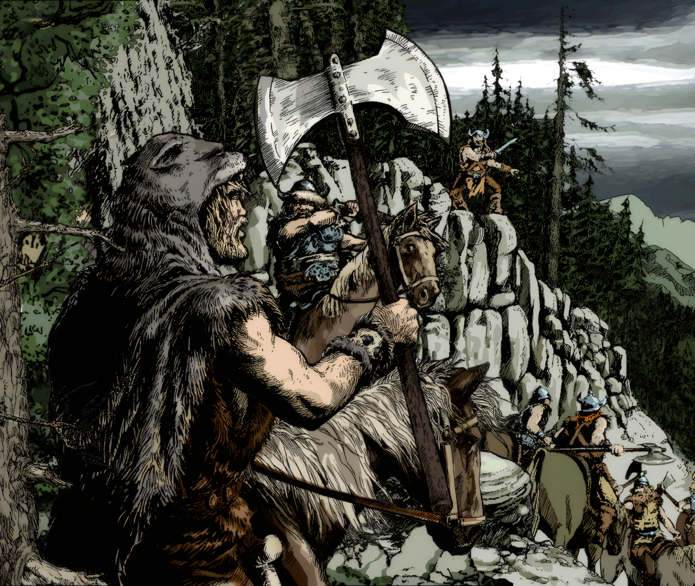
     
    <b>Imperivm 1 - La Amenaza Teutón</b>

## Descargar

[Descargar](https://github.com/JosueCA/La-Amenaza-Teuton/releases)  

[Descargar mapas](https://github.com/JosueCA/La-Amenaza-Teuton)  

---

## Tabla de Contenidos

1. [Correcciones de Audio (Compatibilidad Wine)](#1-correcciones-de-audio-compatibilidad-wine)
1. [Nuevas resoluciones HD de pantalla](#2-nuevas-resoluciones-hd-de-pantalla)
1. [Correcciones al bioma de invierno](#3-correcciones-al-bioma-de-invierno)
1. [Cambios generales](#4-cambios-generales)
1. [Mapas aleatorios](#5-mapas-aleatorios)
1. [Cambios en Unidades](#6-cambios-en-unidades)
   - [Especialidades](#especialidades)
   - [Unidades Galas](#unidades-galas)
   - [Unidades Romanas](#unidades-romanas)
   - [Unidades Teutón](#unidades-teutón)
   - [Arqueros](#arqueros)
   - [Heroes](#heroes)
   - [Eliminado 'entrenamiento' de las unidades](#eliminado-entrenamiento-de-las-unidades)
   - [Formaciones](#formaciones)
   - [Druidas/Sacerdotes](#druidassacerdotes)
1. [Mejoras de la IA](#7-mejoras-de-la-ia)
   - [Más "inteligente"](#más-inteligente)
   - [Sistema de Construccion de Ejercito](#sistema-de-construccion-de-ejercito)
     - [Investigacion Proactiva](#investigacion-proactiva)
     - [Seleccion de Unidades Mejorada](#seleccion-de-unidades-mejorada)
     - [Sistema de Contra-Unidades Mejorado](#sistema-de-contra-unidades-mejorado)
   - [Prioridades de Ataque](#prioridades-de-ataque)
   - [Fortaleza](#fortaleza)
   - [Druidas y Magia](#druidas-y-magia)
   - [Monitor de Escuadrones](#monitor-de-escuadrones)
   - [Teutones](#teutones)
   - [Ruinas](#ruinas)
   - [Items](#items)
   - [Aldeas](#aldeas)
   - [Fortínes](#fortínes)
   - [Animales](#animales)
1. [Colores de Jugadores](#8-colores-de-jugadores)
1. [Notas de Instalacion](#9-notas-de-instalacion)

---

## 1. Correcciones de Audio (Compatibilidad Wine)

- **Conversión de codec de audio**: Los archivos de voz de las unidades usaban el codec Microsoft ADPCM, que Wine no soporta completamente. Se convirtieron **120+ archivos WAV** de voces (galos, romanos y teutones) a PCM estándar para que funcionen correctamente en Linux/Wine.
- Convertidos archivos de audio de las aventuras 'Celtic Kings Adventure' y 'Tutorial'

## 2. Nuevas resoluciones HD de pantalla

| Resolución | Ancho | Alto | Aspecto |
|------------|-------|------|---------|
| Res1 | 1024 | 768 | 4:3 |
| Res2 | 1152 | 864 | 4:3 |
| Res3 | 1280 | 720 | 16:9 |
| Res4 | 1280 | 800 | 16:10 |
| Res5 | 1280 | 1024 | 5:4 |
| Res6 | 1360 | 768 | 16:9 |
| Res7 | 1366 | 768 | 16:9 |
| Res8 | 1400 | 1050 | 4:3 |
| Res9 | 1440 | 900 | 16:10 |
| Res10 | 1600 | 900 | 16:9 |
| Res11 | 1600 | 1024 | 25:16 |
| Res12 | 1600 | 1050 | 32:21 |
| Res13 | 1600 | 1200 | 4:3 |
| Res14 | 1600 | 1280 | 5:4 |
| Res15 | 1680 | 1050 | 16:10 |
| Res16 | 1920 | 1080 | 16:9 |

Imperivm 1 solo soporta resoluciones horizontales de hasta 1600 píxeles máximo (valor hardcodeado en el binario).

**Las resoluciones 15 y 16 (1680x1050 y 1920x1080) o mayores de 1600 requieren el ejecutable parcheado para jugar.**

1) EL ZOOMMAP ESTÁ LIMITADO A 1600 PARA QUE EL JUEGO NO SE CIERRE.

## 3. Correcciones al bioma de invierno
- Reemplazadas las imágenes de los minimap por las de verano
- Reducida la exposición (brillo) de las texturas de terreno de invierno

    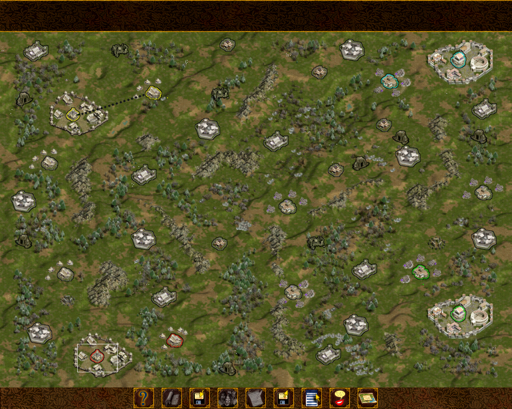

    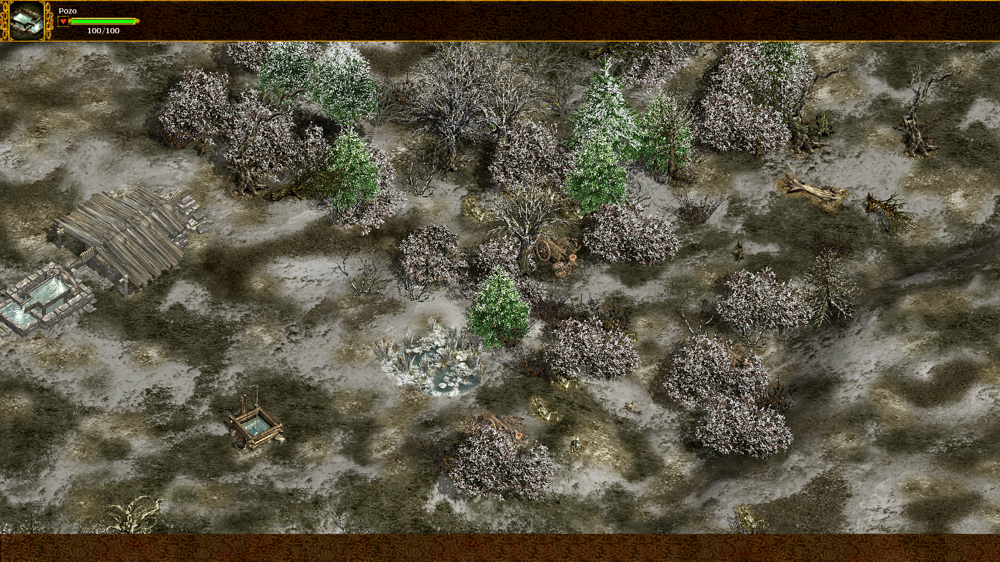

## 4. Cambios generales
- Cambios en la música
- Pequeños ajustes en la interfaz del juego
- Vídeo introductorio reescalado
- Mejorada estabilidad del juego
- La barra de vida de las unidades (función activada con la tecla '~') se ha limitado a los Héroes. Limitado a las unidades del jugador
- Nuevo tipo de partida 'Total war' (Eliminación, pero con reclutamiento multiplicado x5)

## 5. Mapas aleatorios
- Modificada generación de mapas aleatoria
- Reutilizados assets para generar decorados más variados
- Aumentado el ratio de decoraciones
- Añadidos más decorados que generan items
- Disminuido número de ciervos

    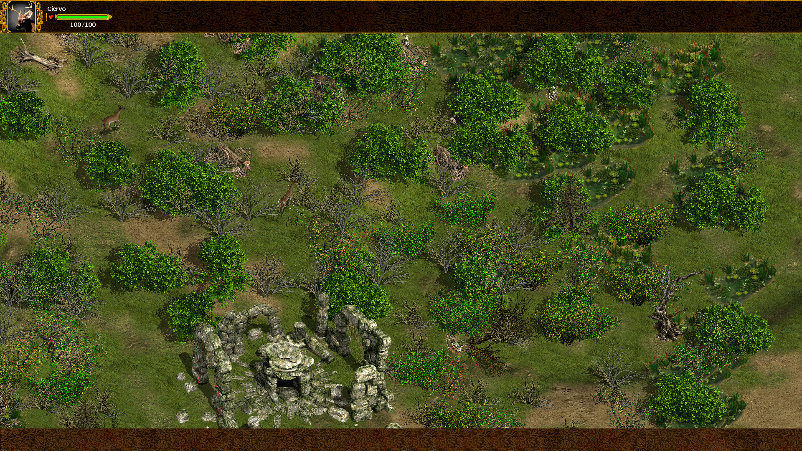

    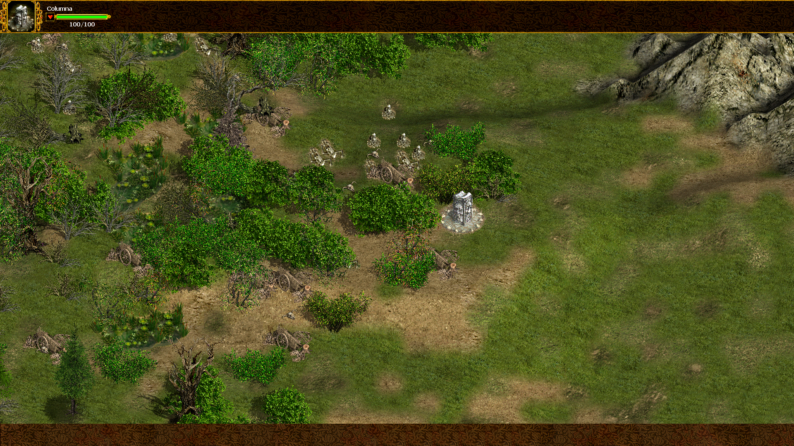

## 6. Cambios en Unidades

## Especialidades

| Especialidad | Valor | Descripción |
|---|---|---|
| `daño expansivo/spread damage` | 175 % | El daño aumenta cuanto más dañado este el objetivo |
| `daño conjunto/trample damage` | 25 % | La unidad inflige un 25 % de daño a los enemigos cercanos |
| `daño reflejado/spike damage` | 25 % | Devuelve 25% del daño al atacante. |
| `carga/charge`  | 800 % / 8 000 ms | Multiplica el daño por 800% con una recarga de 8 segundos sin atacar |
| `golpe del vampiro/vampire blow` | 33 % | Recupera el 33 % del daño infligido como salud propia. |
| `golpe letal/death blow` | 33 % | Cuando el objetivo tiene menos del 33% de vida el siguiente ataque lo mata de un golpe. |
| `posición defensiva/defensive stand` | — | Resiste el primer golpe del atacante |
| `libertad/freedom` | — | No permite unirse a los héroes. |

---

## Unidades Galas

| Unidad | Salud | Ataque | Tipo de ataque | Def. Corte | Def. Pierce | Velocidad | Rango | Especialidad |
|---|---|---|---|---|---|---|---|---|
| Guerrero | 200 | 10–18 | slash | 0 | 0 | 100 | — | — |
| Arquero | 100 | 4–8 | pierce | 0 | 0 | 80 | 400 | daño expansivo |
| Guerrero con hacha | 260 | 16–24 | slash | 0 | 0 | 80 | — | daño conjunto |
| Lancero | 280 | 16–24 | pierce | 6 | 6 | 80 | — | posición defensiva, daño expansivo |
| Jinete | 360 | 10–24 | slash | 0 | 0 | 140 | — | carga |
| Mujer guerrera | 340 | 18–36 | slash | 0 | 8 | 80 | — | golpe del vampiro |
| Druida | 120 | — | — | — | — | 60 | 200 | — |
| Jefe Normando | 3000 | 42–84 | slash | 6 | 6 | 80 | — | libertad, carga |

---

## Unidades Romanas

| Unidad | Salud | Ataque | Tipo de ataque | Def. Corte | Def. Pierce | Velocidad | Rango | Especialidad |
|---|---|---|---|---|---|---|---|---|
| Legionario | 240 | 13–17 | slash | 0 | 7 | 80 | — | posición defensiva |
| Arquero | 125 | 5–10 | pierce | 0 | 0 | 80 | 400 | daño expansivo |
| Gladiador | 255 | 23–23 | pierce | 3 | 3 | 100 | — | daño expansivo |
| Princep | 300 | 17–27 | slash | 7 | 15 | 80 | — | posición defensiva, daño reflejado |
| Equite | 330 | 13–21 | slash | 0 | 0 | 140 | — | carga |
| Pretoriano | 475 | 27–47 | pierce | 10 | 10 | 80 | — | golpe letal |
| Sacerdote | 120 | — | — | — | — | 60 | 200 | — |
| Liberati | 400 | 30–30 | slash | 0 | 0 | 120 | — | — |

---

## Unidades Teutón

| Unidad | Salud | Ataque | Tipo de ataque | Def. Corte | Def. Pierce | Velocidad | Rango | Especialidad |
|---|---|---|---|---|---|---|---|---|
| Arquero Teutón | 200 | 8–18 | pierce | 0 | 0 | 160 | 400 | — |
| Jinete Teutón | 250 | 12–22 | slash | 0 | 0 | 160 | — | daño conjunto |
| Arquero Galo Teutón | 100 | 4–8 | pierce | 0 | 0 | 80 | 400 | — |
| Espadachín Galo Teutón | 260 | 10–18 | slash | 0 | 0 | 80 | — | — |
| Arquero Romano Teutón | 125 | 5–9 | pierce | 0 | 0 | 80 | 400 | — |
| Hastatus Romano Teutón | 240 | 13–17 | slash | 0 | 7 | 80 | — | — |

---

### Arqueros
- Arqueros con más alcance
- Más débiles
- Fuertes contra unidades con poca vida (habilidad)

### Heroes
- Modificaciones en las estadísticas base de heroes (más resistentes)
- Más vida por nivel
- Reutilizados assets de héroes para generar más héroes aleatorios

    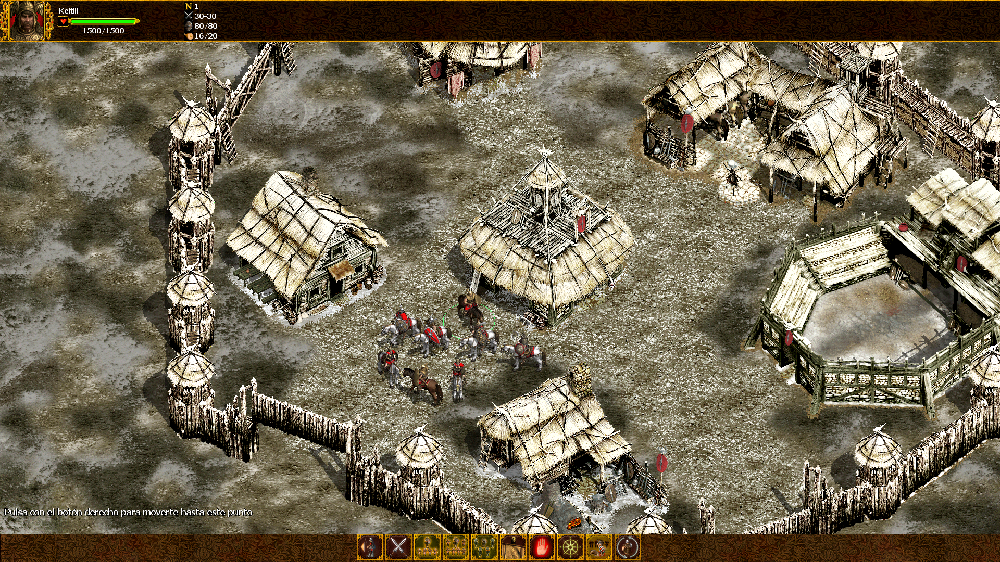

- Los héroes pueden ordenar a los Druidas/Sacerdotes asignados a lanzar sus hechizos

    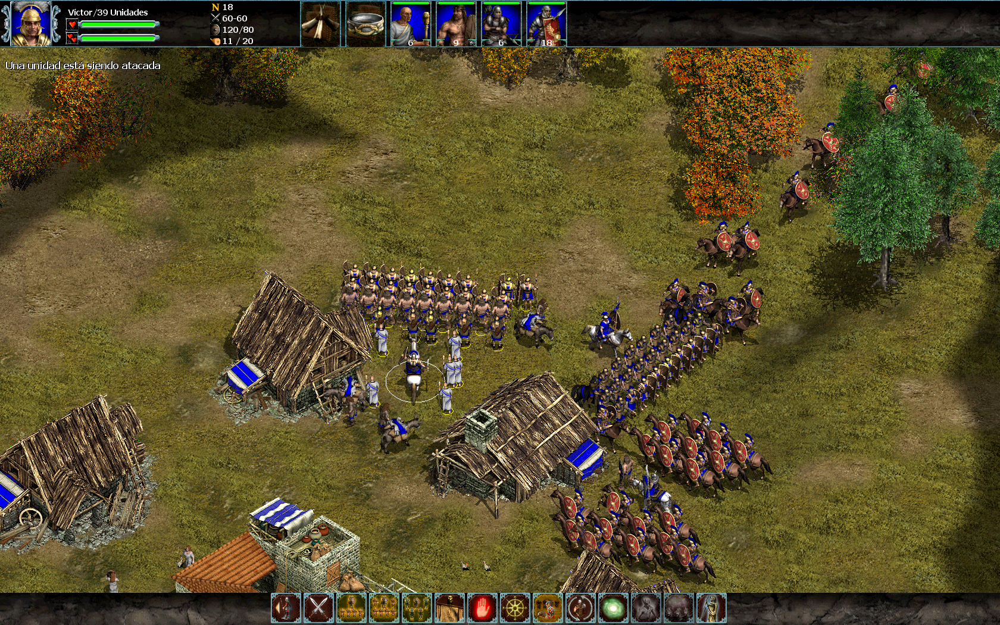

### Eliminado 'entrenamiento' de las unidades
- Las unidades del cuartel se generan con el nivel según el nivel de 'entrenamiento' investigado

    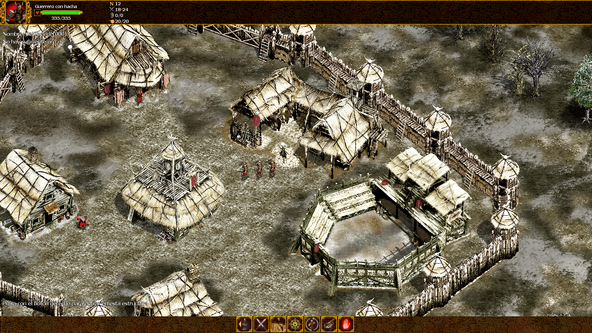

### Formaciones
- Reducido el 'radio' de las unidades en formación. Las unidades en formaciones están más cerca entre sí.
- Modificadas estructuras de las formaciones

    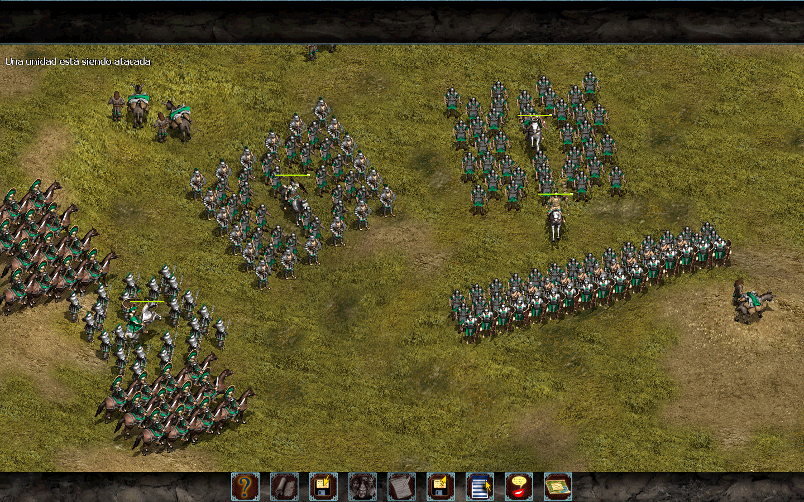

### Druidas/Sacerdotes
- Reducido daño de los hechizos
- Reimplementado la 'Nube Venenosa' (sacerdote) para que no dañe a unidades amigas

### Nueva mejoras
- 'Championships' en la taverna Romana
- 'Imported Horses' añade un item a los Equites

## 7. Mejoras de la IA

### Más "inteligente"
- Mayor dificultad al jugar contra la IA
- Añadida una estrategia inicial en las partidas aleatorias

### Sistema de Construccion de Ejercito

#### Investigacion Proactiva
- Mejorado algoritmo de investigación

#### Seleccion de Unidades Mejorada
- Nuevos **weights** favorecen ejércitos más variados

#### Sistema de Contra-Unidades Mejorado
- Mejor respuesta a las amenazas

### Prioridades de Ataque
- Mejor gestion de objetivos, IA más agresiva
- Mayores ejércitos

### Fortaleza
- La IA investiga las mejoras en el coliseo, taberna, templo
- Corregidas animaciones de campesinos en las fortalezas romanas, además de añadir los edificios faltantes
- Añadidos legionario (Roma)/arquero galo (Galo) a las animaciones de campesinos
- Desde el foro se pueden ejecutar los hechizos de los altares (el altar se elige aleatoriamente)

    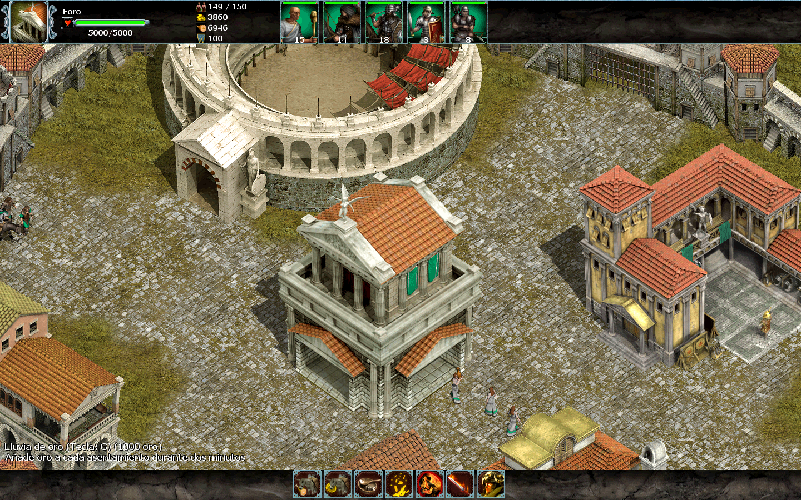

### Druidas y Magia
- Ajustes al sistema de reclutamiento de druidas
- La IA utiliza los altares durante las partidas aleatorias
- La IA utiliza los hechizos en el combate (Espiritu Vampiro, Nube venenosa)

    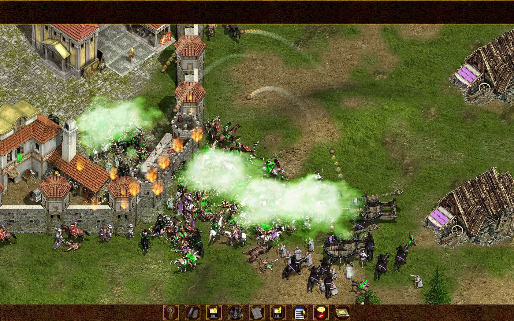

### Monitor de Escuadrones
- Ajustes al sistema de monitoreo y control de unidades

### Teutones
- Los Teutones pueden capturar fortalezas de los jugadores

    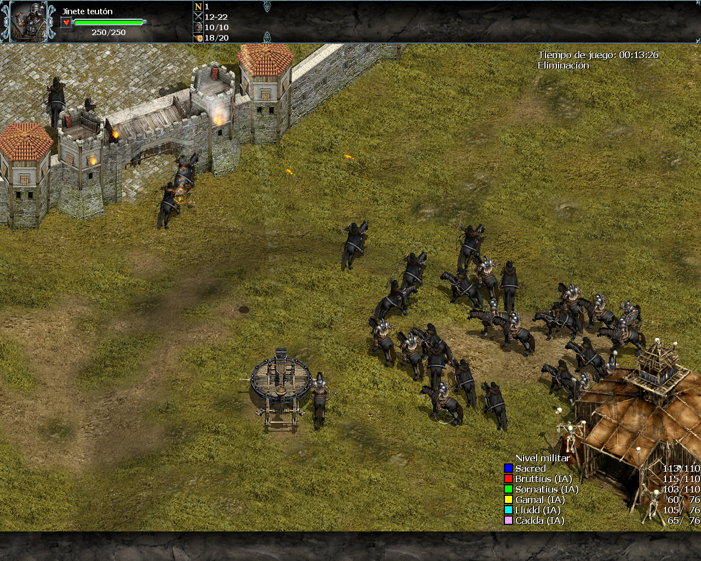

### Ruinas
- La IA usa mejor las ruinas

### Items
- Mejorado el sistema de recogida y uso de items

    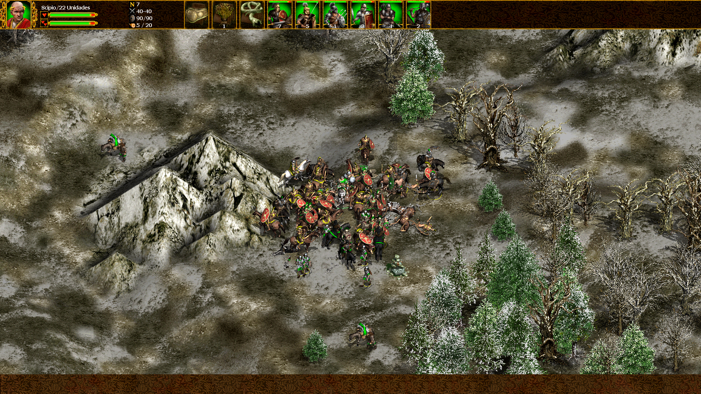

### Aldeas
- Las aldeas producen campesinos automáticamente junto a las mulas de comida

### Fortínes
- Añadidos defensores iniciales a los fortínes

    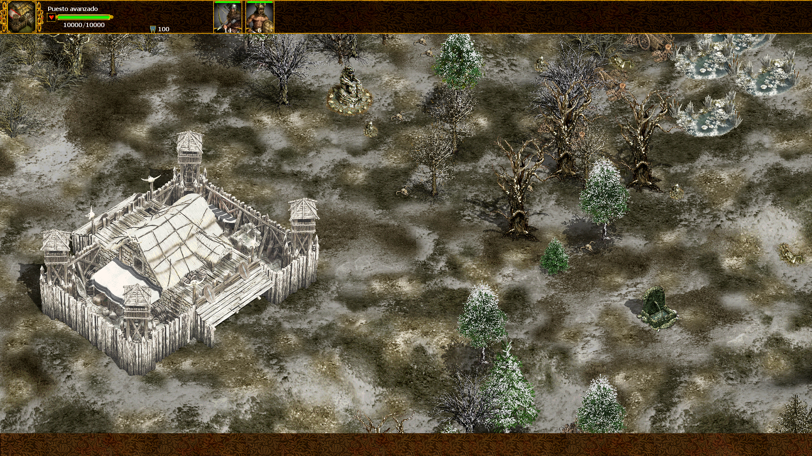

    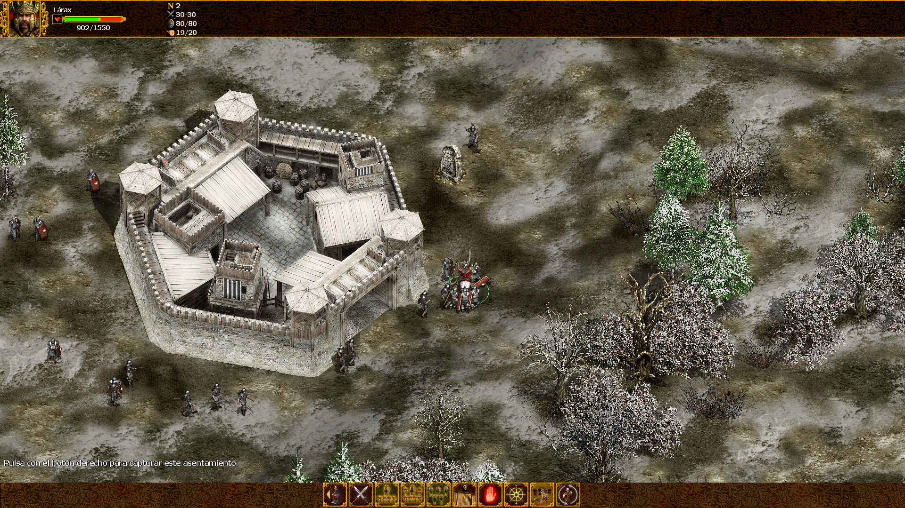

### Animales
- Corregido bug de los ciervos atascados en los bordes del mapa

## 8. Colores de Jugadores

Rediseño de los colores de los jugadores para maximizar la distinción visual entre ellos y evitar interferencias.

| ID    | Color original | HEX original | Color nuevo | HEX nuevo  |
|-------|---------------|--------------|-------------|------------|
| id1   |  | `#FF1717` |  | `#FF2222` |
| id2   |  | `#FFFF00` |  | `#CCBB00` |
| id3   |  | `#00FF00` |  | `#00BB77` |
| id4   |  | `#00E8E8` |  | `#0055DD` |
| id5   |  | `#EDA0FF` |  | `#007700` |
| id6   |  | `#B6E686` |  | `#9900CC` |
| id7   |  | `#AE0000` |  | `#FF8800` |
| id8   |  | `#F99B20` |  | `#66AA00` |
| id9   |  | `#109B12` |  | `#0099CC` |
| id10  |  | `#0000F8` |  | `#4400AA` |
| id11  |  | `#C40DC6` |  | `#FF44CC` |
| id12  |  | `#9F9A00` |  | `#CC0055` |
| id13  |  | `#808080` |  | `#555555` |

## Y muchos más cambios sin documentar...

## 9. Notas de Instalacion

Este MOD se aplica directamente sobre la instalacion del juego. Reemplazando los archivos .pak y demás directorios/ficheros incluidos en el zip.
